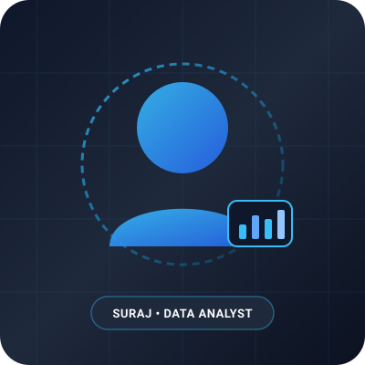

# Manual Changes Required & Personalization Guide

This document lists every value, placeholder, link, and asset you need to replace to personalize your portfolio website. All items are organized by file and section.

---

## 🚀 Quick Checklist Before Launching

```text
===========================================================
MANDATORY REPLACEMENTS (FOR JOB APPLICATIONS)
===========================================================
[ ] 1. Email Address             -> Search "YOUR_EMAIL_HERE"
[ ] 2. LinkedIn Profile URL      -> Search "YOUR_LINKEDIN_URL"
[ ] 3. GitHub Profile URL        -> Search "YOUR_GITHUB_URL"
[ ] 4. Location (City, Country)  -> Search "YOUR_LOCATION_HERE"
[ ] 5. MCA College / University  -> Search "YOUR_COLLEGE_NAME"
[ ] 6. Resume PDF File           -> Place your PDF at assets/resume/Suraj_Resume.pdf
[ ] 7. Profile Picture           -> Place your photo in assets/images/

===========================================================
RECOMMENDED CONTENT PERSONALIZATIONS
===========================================================
[ ] 8. Experience Section        -> Replace internship / training placeholders
[ ] 9. Bachelor's Degree Details -> Add your undergrad college & degree name
[ ] 10. CGPA / Percentage        -> Add your actual academic scores
[ ] 11. Project Links & Demos    -> Add your GitHub repo URLs & Power BI / Tableau demo links
===========================================================
```

---

## 1. `index.html`

Open `index.html` in VS Code or your preferred text editor and use **Find & Replace** (`Ctrl + H` on Windows, `Cmd + H` on Mac) for each term below:

### 1.1 Contact Information & Socials (Required)

#### 1. Email Address
- **Search for:** `YOUR_EMAIL_HERE`
- **Locations found:**
  - Hero Section email link (`mailto:YOUR_EMAIL_HERE`)
  - Contact Section Direct Card
  - Footer email link
- **Replace with:** Your professional email address (e.g., `suraj.analytics@gmail.com`).

#### 2. LinkedIn Profile
- **Search for:** `YOUR_LINKEDIN_URL`
- **Locations found:**
  - Hero Section (`https://www.linkedin.com/in/YOUR_LINKEDIN_URL`)
  - Contact Section Card
  - Footer navigation link
- **Replace with:** Your LinkedIn profile URL slug (e.g., `suraj-data-analyst`).

#### 3. GitHub Profile
- **Search for:** `YOUR_GITHUB_URL`
- **Locations found:**
  - Hero Section (`https://github.com/YOUR_GITHUB_URL`)
  - Contact Section Card
  - Project Cards (GitHub Code links)
  - Footer navigation link
- **Replace with:** Your GitHub username (e.g., `suraj-codes`).

#### 4. Location
- **Search for:** `YOUR_LOCATION_HERE`
- **Locations found:**
  - About Section "Professional Overview" card
  - Contact Section "Direct Channels" card
- **Replace with:** Your city and state/country (e.g., `Bengaluru, Karnataka, India`).

---

### 1.2 Education Details

#### 1. MCA (Master of Computer Applications)
- **Search for:** `YOUR_COLLEGE_NAME`
  - **Replace with:** The official name of your current MCA institution.
- **Search for:** `YOUR_COLLEGE_LOCATION`
  - **Replace with:** City/State of your college.
- **Search for:** `YOUR_CGPA_HERE`
  - **Replace with:** Your current CGPA (e.g., `8.6 / 10.0` or `In Progress`).

#### 2. Bachelor's Degree
- **Search for:** `[Bachelor's Degree Title — e.g. BCA / B.Sc. / B.Tech]`
  - **Replace with:** Your undergraduate degree title (e.g., `Bachelor of Computer Applications (BCA)` or `B.Sc. Computer Science`).
- **Search for:** `YOUR_BACHELOR_COLLEGE`
  - **Replace with:** Name of your undergraduate college/university.
- **Search for:** `YOUR_BACHELOR_LOCATION`
  - **Replace with:** Location of your undergraduate college.
- **Search for:** `[Start Year] – [Graduation Year]`
  - **Replace with:** Your graduation period (e.g., `2021 – 2024`).
- **Search for:** `YOUR_BACHELOR_SCORE`
  - **Replace with:** Your final percentage or CGPA (e.g., `82.5%` or `8.5 CGPA`).

---

### 1.3 Experience & Practical Training

Navigate to `<section id="experience">`:

- **Search for:** `[Internship / Training Role Title — e.g., Data Analyst Intern]`
  - **Replace with:** Your job title or training program title.
- **Search for:** `[Organization / Company / Training Institute Name]`
  - **Replace with:** Company or academy name.
- **Search for:** `[Start Date] – [End Date / Present]`
  - **Replace with:** Duration (e.g., `Jun 2024 – Aug 2024`).
- **Search for:** The 3 placeholder bullet points under `timeline-task-list`
  - **Replace with:** Your specific analytical tasks, datasets handled, and achievements.

---

### 1.4 Projects Showcase & Live Links

Navigate to `<section id="projects">` and `<div class="modal-overlay">`:

For each of the 4 project cards and modals:
- **GitHub Repository Links:**
  - Search: `https://github.com/YOUR_GITHUB_URL/retail-sales-dashboard`
  - Search: `https://github.com/YOUR_GITHUB_URL/semiconductor-quality-analysis`
  - Search: `https://github.com/YOUR_GITHUB_URL/data-extraction-pipeline`
  - Search: `https://github.com/YOUR_GITHUB_URL/salesforce-crm-setup`
  - Replace with your actual GitHub project repository URLs.
- **Live Demo & Notebook Links:**
  - Search: `https://YOUR_DEMO_URL_HERE.com`
  - Replace with your Power BI / Tableau public dashboard links, Streamlit apps, Kaggle notebooks, or GitHub Pages.

---

## 2. Web3Forms Contact Form Configuration

Your contact form is already integrated with **Web3Forms** using client-side JavaScript `fetch()`:

* **Endpoint:** `https://api.web3forms.com/submit`
* **Access Key:** `2ce485c9-c6ff-4b2c-b7aa-99a9f2144345`

### How It Works:
1. When a visitor submits the form, JavaScript validates their Name, Email, and Message.
2. The form enters a loading state (`Sending...` with spinner).
3. The message is delivered directly to the email registered with this Web3Forms access key.
4. The visitor receives a clean confirmation banner without ever leaving your portfolio website.

> **Note:** If you ever wish to use your own separate Web3Forms key in the future, simply replace the `access_key` value in `index.html` on Line ~460. No backend or secret server configuration is required.

---

## 3. `assets/` Folder (Images & Resume PDF)

### 3.1 Resume PDF File (Mandatory)
* **Target File Path:** `assets/resume/Suraj_Resume.pdf`
* **Instructions:**
  1. Export your resume from Word/Google Docs/Canva as a PDF.
  2. Rename the file exactly to: `Suraj_Resume.pdf` (case-sensitive).
  3. Replace the placeholder file inside the `assets/resume/` folder.
  4. Both the **"Download Resume"** and **"View Resume"** buttons are configured to point directly to this file.

### 3.2 Profile Image
* **Target File Path:** `assets/images/profile.svg` (or `profile.jpg` / `profile.png`)
* **Instructions:**
  1. Save your professional headshot into `assets/images/` as `profile.jpg`.
  2. In `index.html` (Line ~125), update the image source:
     ```html
     <!-- Change from: -->
     
     <!-- To: -->
     
     ```

### 3.3 Project Preview Images
* **Target File Paths:** `assets/images/project-1.svg` through `project-4.svg`
* **Instructions:**
  1. Take screenshots of your Power BI reports, SQL schema diagrams, or Jupyter notebooks (recommended size: `600x360` px).
  2. Save them into `assets/images/` as `project-1.jpg`, `project-2.jpg`, etc.
  3. Update the corresponding `src` attributes in `index.html`.

---

## 4. Theme & Customization Options

### 4.1 Customizing Colors
Open `style.css` and modify variables in `:root` (Light Theme) or `[data-theme="dark"]` (Dark Theme):

```css
:root {
  /* Default Light Palette */
  --bg-primary: #F7F5F0;    /* Warm ivory background */
  --text-primary: #18212B;  /* Deep charcoal headings & text */
  --accent: #8A6A3E;        /* Muted bronze / warm gold accent */
}

[data-theme="dark"] {
  /* Dark Mode Palette */
  --bg-primary: #11161D;    /* Deep charcoal/navy background */
  --text-primary: #EDEDEB;  /* Warm off-white headings & text */
  --accent: #C5A059;        /* Warm golden bronze */
}
```

### 4.2 Disabling or Changing Custom Cursor
In `style.css`, to turn off the desktop cursor ring:
```css
.cursor-dot,
.cursor-ring {
  display: none !important;
}
```
